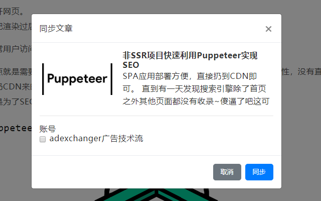
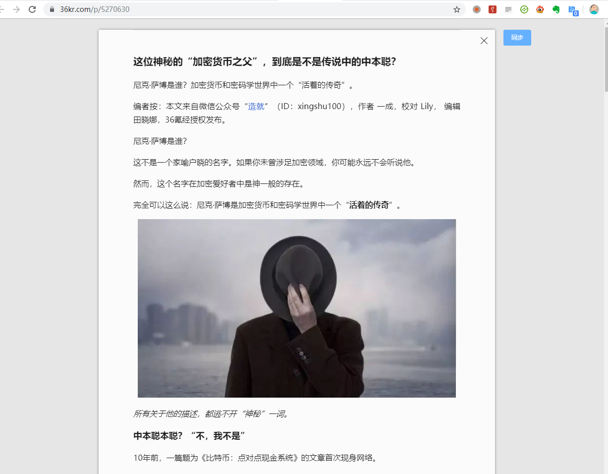
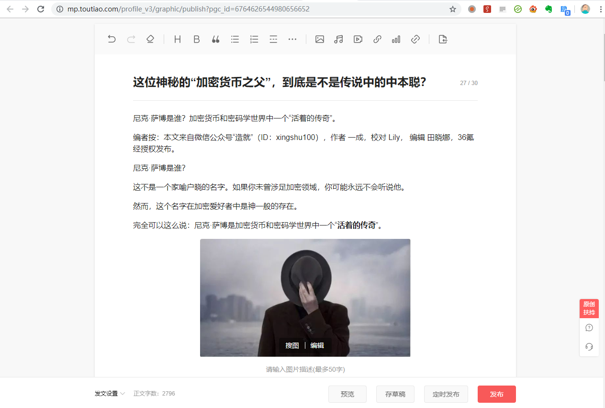
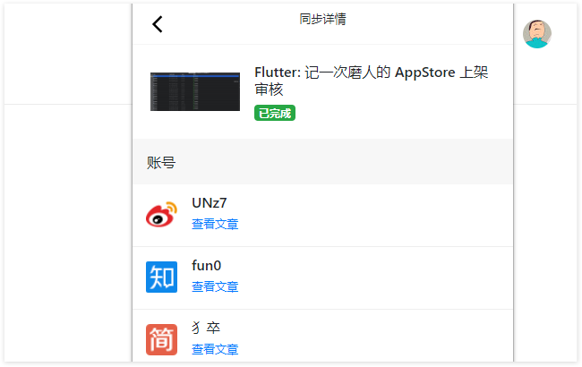
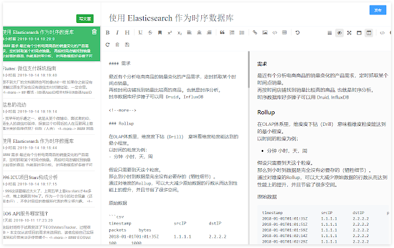
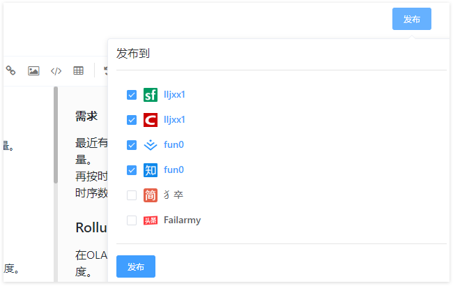

# 文章同步助手

还在为一次编辑，N 个平台需多次排版上传脑壳疼吧？
为广大自媒体朋友撸了个提高生产力的小工具、可以做到的在多个内容平台无缝同步。

[API文档](https://github.com/wechatsync/Wechatsync/blob/master/API.md)

## 特性

<!-- #### 公众号文章同步 -->
- [x] 公众号文章同步
- [x] Markdown 编辑器
- [x] 网页正文提取（基于 Safari 阅读模式） 可实现多平台互同步
- [ ] 本地Markdown同步
- [ ] Markdown支持公众号样式定义

## 支持渠道
| 媒体           | 媒体行业  | 状态  | 网址                                | 支持类型          | 检查时间      |
|--------------|-------|-----|-----------------------------------|---------------|-----------|
| 微信公众号        | 主流自媒体 | 已支持 | https://mp.weixin.qq.com/         | HTML          | 2021/3/17 |
| 知乎           | 主流自媒体 | 已支持 | https://www.zhihu.com/            | HTML          | 2021/3/17 |
| 微博           | 主流自媒体 | 已支持 | https://weibo.com/                | HTML          | 2021/3/17 |
| Bilibili     | 通用行业  | 已支持 | https://www.bilibili.com/         | HTML          | 2021/3/17 |
| 豆瓣           | 通用行业  | 已支持 | https://www.douban.com/           | HTML          | 2021/3/17 |
| 百家号          | 通用行业  | 已支持 | https://baijiahao.baidu.com/      |               | 2021/3/17 |
| 简书           | 通用行业  | 已支持 | https://www.jianshu.com/          | HTML          | 2021/3/17 |
| 头条号          | 通用行业  | 已支持 | https://mp.toutiao.com/           | HTML          | 2021/3/17 |
| 搜狐号          | 通用行业  | 已支持 | https://mp.sohu.com/mpfe/v3/login |               | 2021/3/17 |
| 大鱼号          | 通用行业  | 已支持 | https://mp.dayu.com/              |               | 2021/3/21 |
| 一点资讯         | 通用行业  | 已支持 | https://www.yidianzixun.com/      | HTML          | 2021/3/18 |
| Cnblog       | 技术社区  | 已支持 | https://www.cnblogs.com/          | Markdown,HTML | 2021/3/17 |
| CSDN         | 技术社区  | 已支持 | https://www.csdn.net/             | Markdown,HTML | 2021/3/17 |
| 51CTO        | 技术社区  | 已支持 | https://www.51cto.com/            | Markdown,HTML | 2021/3/17 |
| Segmentfault | 技术社区  | 已支持 | https://segmentfault.com/         | Markdown,HTML | 2021/3/17 |
| 掘金           | 技术社区  | 已支持 | https://juejin.cn/                | HTML,Markdown | 2021/3/17 |
| 慕课网-手记       | 技术社区  | 已支持 | https://www.imooc.com/article     |               | 2021/3/21 |
| 开源中国         | 技术社区  | 已支持 | https://my.oschina.net/           |               | 2021/3/18 |
| Typecho      | 开源CMS | 已支持 | http://typecho.org/               | HTML          | 2021/3/17 |
| WordPress    | 开源CMS | 已支持 | https://cn.wordpress.org/         | HTML          | 2021/3/17 |
| 搜狐焦点         | 房地产   | 已支持 | https://house.focus.cn/           | HTML          | 2021/3/17 |

- [待支持的平台列表](https://airtable.com/shrLSJMnTC2BlmP29)

### 兼容发布API 
你也可以通过兼容wordpress xmlrpc协议来使你的网站支持使用文章同步助手来同步

#### PHP
- [dedecms thinkphp等php后端可以伪装wordpress xmlrpc协议支持文章同步助手同步](intergrations/php/)

## 网页发起同步任务
如果你是文章编辑器开发者，或自己有内容库需要同步多个渠道，引入这个JS SDK:  
https://github.com/wechatsync/article-syncjs
- window.syncPost(article) 拉起同步任务框

## 贡献代码
- [待支持的平台列表](https://airtable.com/shrLSJMnTC2BlmP29)
- [API文档](API.md)
- [如何开发一个适配器](docs/toturial.md)

## 安装方式

#### Chrome 商店

[传送门](https://chrome.google.com/webstore/detail/%E5%BE%AE%E4%BF%A1%E5%90%8C%E6%AD%A5%E5%8A%A9%E6%89%8B/hchobocdmclopcbnibdnoafilagadion)

#### 开发者模式安装

1. [下载](http://wpics.oss-cn-shanghai.aliyuncs.com/WechatSync.zip?date=0625) 并解压
2. 打开 chrome://extensions
3. 右上角“开启开发者模式”
4. 拖入解压后的文件夹到浏览器插件页

## 预览

<!-- #### 正文提取

 -->

#### 同步详情

#### Markdown 编辑器

#### 多渠道选择

## 背景

早在几年前，同事就在为 WordPress 和微信公众号之间不同排版而烦恼，每次都是两边重复排版一遍。
2016 年的时候给他写了个爬虫，基于搜狗+打码平台+抓取内容，自动上传图片到 WordPress 博客。
最后他只需要专注于公众号这边的内容发布即可！

但是最近这个方案有点问题了，修起来也麻烦。

于是便有了这个基于浏览器插件的方案，所有信息都存储在本地。
不同于简媒、OpenWrite 之类基于云端的一键发布方案，免去了 Cookie 可能被盗用的安全风险。
相比 artipub 需要自己部署安装的方案，也要方便很多

https://www.v2ex.com/t/573320

## 更新日志

### 0.0.9

- 今日头条同步失败更明确的提示
- 修复今日头条不因为要手机号验证不能直接发布的问题，改为同步过去是草稿
- 解决了微信如果有外链及视频会无法同步到今日头条情况

### 0.0.6

- 新增 CSDN、掘金、博客园、思否等多个渠道
- 新增 Markdown 编辑器

### 0.0.5 - 2019.06.25

- 修复 typecho 同步 bug
- 修复简书同步 bug
- 修复代码块同步 bug

### 0.0.4 - 2019.06.16

- 修复头条 bug、微信标题被遮挡
- 修复代码块到知乎不换行的问题
- 新增 typecho
- 新增头条号

### 0.0.3 - 2019.06.12

- 新增简书，知乎

### 0.0.2 - 2019.06.09

- 新增同步详情
